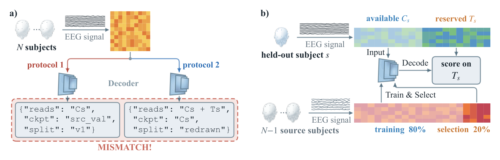
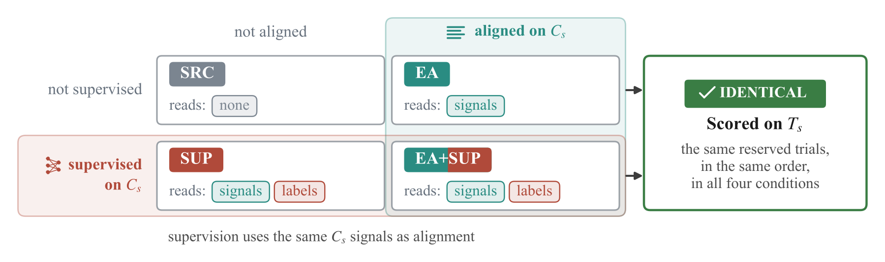
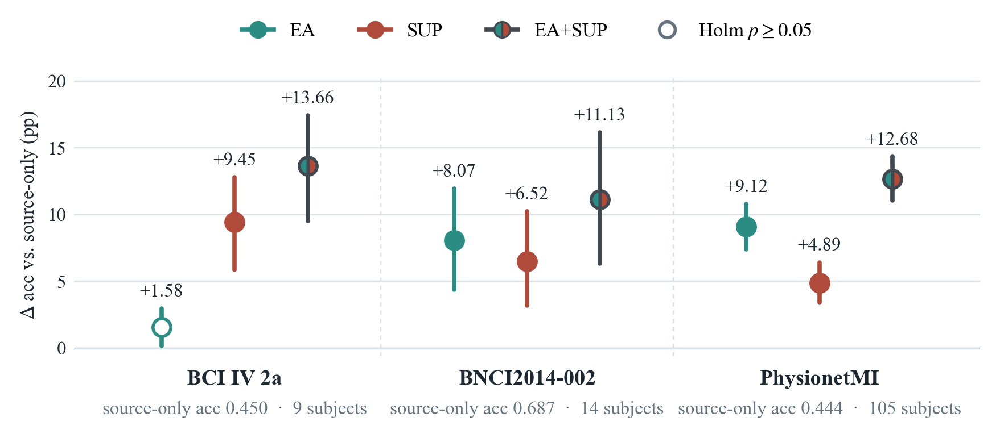
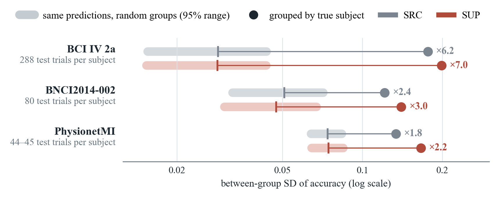
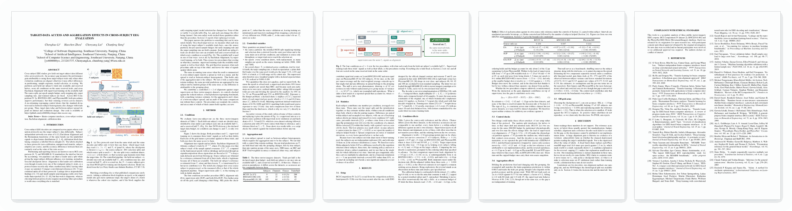

<div align="center">

# Target-Data Access and Aggregation Effects<br>in Cross-Subject EEG Evaluation

Chenghao Li · Haochen Zhou · Chenyang Liu · Chunfeng Yang<br>
Southeast University, Nanjing, China

[](manuscript/main.pdf)
[](results/)
[](#environment)
[](#environment)
[](LICENSE)

</div>



**(a)** Two protocols run the same trials through the same decoder under different
rules (which target trials they read, where they choose the checkpoint, which
source split they train on), so their accuracy gap measures more than the target
data. **(b)** The controlled pipeline: each held-out subject is split once into an
available half $C_s$, the only target data a condition may use, and a reserved
half $T_s$, on which every condition is scored. The $N-1$ source subjects give
one fixed 80/20 split for training and checkpoint selection.

Cross-subject EEG decoders are compared across protocols that give the held-out
subject's data different roles, and the accuracy gaps between them are read as
the value of that access. That reading holds only when everything else in the
evaluation is matched. This repository contains the experiments that match it,
the run logs they produced, with per-trial predictions, and the LaTeX source of
the paper.

## At a glance

- **A controlled 2×2.** Euclidean Alignment (EA) is crossed with supervised
  training on the held-out subject's available trials (SUP) on BCI Competition
  IV 2a, BNCI2014-002 and PhysionetMI. The source split, per-epoch sample
  budget, early-stopping rule, target sampling rate and realized indices are
  fixed, and a script checks them against the real data before any run.
- **Both procedures help, in an order that reverses.** Supervision improves
  accuracy on all three datasets and alignment on two of the three. In an
  exploratory comparison, supervision leads alignment by +7.87 pp on 2a and
  trails it by 4.23 pp on PhysionetMI.
- **The spread depends on trials per group.** Dealing the same predictions into
  random groups of the same sizes gives a between-group SD of 0.029 on 2a
  against 0.177 by true subject. That factor of 6.2 falls to 2.4 and 1.8 as the
  test trials per subject fall from 288 to 80 and 45.
- **An audit.** Replaying an earlier version of this study, which enforced none
  of these controls, shows its cross-dataset ordering following the target's
  share of a batch: 6.1%, 3.8% and 0.5%.

## Design



The four conditions differ only in what they do with the available half $C_s$:
nothing (SRC), Euclidean Alignment (EA), supervised training (SUP), or both
(EA+SUP). Supervised training reads the available trials' signals as well as
their labels, so the two procedures overlap in what they consume, and the grid
measures what each adds on top of the other. Two further arms sit off the grid:
SEL chooses the checkpoint on $C_s$, and POOL adds $C_s$ to the scaler's fit set.

Everything else is held fixed:

| Held fixed | How |
|---|---|
| Source partition | one stratified 80/20 split of the source subjects, the same indices in every condition; checkpoints are chosen on source trials only |
| Epoch length | every condition draws as many samples per epoch as the source training set holds (3686, 1664 and 7486) |
| Target sampling rate | a weighted sampler with an expected target share of 0.10 per batch, realized at 0.096–0.109 |
| Alignment reference | estimated on $C_s$ alone, then frozen; $T_s$ never contributes to it |
| Scored trials | $T_s$, identical across conditions, trial for trial |

The design leaves two quantities unequal, and the paper reports both: a
supervised arm draws 10% fewer source samples per epoch, and early stopping
leaves each arm with its own number of updates. How often each target trial is
drawn per epoch also differs (1.3, 2.1 and 16.6 times), which is why the
calibration budget is varied directly.

## Results



Each procedure's effect on accuracy against its own source-only reference,
paired within subject, from our EEGNet implementation. Bars are unadjusted 95%
percentile bootstrap intervals over subjects. A hollow marker means the
Holm-corrected $p$ is not below 0.05, the paper's threshold for stating a
difference. Chance differs across the datasets, so compare within a dataset.

<details>
<summary><b>Table 2 in numbers</b></summary>
<br>

| | | BCI IV 2a | BNCI2014-002 | PhysionetMI |
|---|---|:---:|:---:|:---:|
| Source-only acc | | 0.450 | 0.687 | 0.444 |
| **EA** | Δ acc (pp) | +1.58 [+0.17, +2.98] | +8.07 [+4.37, +11.96] | +9.12 [+7.40, +10.81] |
| | $p$ (helped) | 0.176 (7/9) | 0.005 (12/14) | &lt; 0.001 (93/105) |
| **SUP** | Δ acc (pp) | +9.45 [+5.88, +12.81] | +6.52 [+3.18, +10.27] | +4.89 [+3.41, +6.41] |
| | $p$ (helped) | 0.019 (9/9) | 0.005 (12/14) | &lt; 0.001 (72/105) |
| **EA+SUP** | Δ acc (pp) | +13.66 [+9.53, +17.44] | +11.13 [+6.34, +16.16] | +12.68 [+11.04, +14.35] |
| | $p$ (helped) | 0.019 (9/9) | 0.002 (13/14) | &lt; 0.001 (99/105) |

pp: percentage points. $p$ is Holm-corrected within each dataset and followed
by the number of subjects whose accuracy the procedure raised.

</details>

The rest of the paper's checks, in brief:

- **Calibration budget.** $|C_s|$ differs 6.4-fold across the datasets, so the
  arms that consume it were re-run with $|C_s|$ capped. At a common 45 trials
  the lead of supervision over alignment reads +5.88, −2.62 and −4.23 pp: the
  ordering holds, and the budget accounts for about 2 of the 12 pp that separate
  2a from PhysionetMI.
- **Chronological split.** On BCI IV 2a the halves can be cut by session. The
  lead of supervision over alignment is then +7.75 pp [+5.54, +10.29], against
  +7.87 pp under the random split.
- **Reference decoder.** With braindecode's EEGNetv4 in place of our EEGNet,
  source-only accuracy moves by −0.81, +0.27 and −0.55 pp, and the reversal
  reproduces: +8.27 pp on 2a, −4.65 pp on PhysionetMI.
- **Interaction.** Whether the two procedures add up is undetermined: the
  interaction is +2.62, −3.45 and −1.33 pp, and none of the three is resolved.
- **Off-grid arms.** Choosing the checkpoint on $C_s$ changes accuracy by
  −1.69 pp [−2.80, −0.55] on PhysionetMI, where the selection set is smallest
  (45 trials against the 1872 it replaces), and does so again under the
  reference decoder. No POOL arm is resolved.

## Aggregation



The per-trial predictions on $T_s$ are held fixed and only the grouping changes:
by true subject (dots), and into random groups of the same sizes, 2000 times
(bands, with their mean marked). Nothing is retrained and the pooled accuracy
is the same either way, so the difference between the two belongs to the
grouping. The random-group SD follows the finite-population prediction to
within 0.0013, which is why it rises as the trials per group fall. Shuffling
removes the subject structure along with the trial noise, so this benchmark
cannot split a spread into its parts; a conditionally binomial model does that
separately and puts finite trials at 2%, 17% and 29% of the observed
between-subject variance. Values are averaged over the three runs.

## Repository layout

```
experiments/   the runner, the schema gate, the data sources, the control audit
analysis/      every statistic reported in the paper
figures/       the figure and table generators; fig_ab/ draws Figure 1
scripts/       the launch scripts that produced the logs in results/
tests/         73 tests, mostly guards against ways this study has already gone wrong
results/       137 run logs with per-trial predictions, plus the supplements
manuscript/    LaTeX source and the compiled PDF
docs/          the images on this page and the script that draws them
EEGNets/, configs/, train_multidecoder.py
               model and training code the runner imports
```

## Reproducing the paper

Every number in the paper can be recomputed from the logs in `results/` without
retraining. One command rebuilds the statistics bundle, Table 2 and two figures
that did not fit in the paper:

```bash
python analysis/build_paper_evidence.py
```

Individual analyses:

```bash
python analysis/v4_stats.py "BCI IV 2a=results/v4_2a/*.json" \
    "BNCI2014-002=results/v4_002/*.json" \
    "PhysionetMI=results/v4_physionet/*.json" \
    --out results/v4_stats.json            # main grid and regrouping
python analysis/dose_stats.py              # calibration budget
python analysis/reference_check.py         # braindecode decoder
python analysis/session_split.py           # chronological split
python analysis/variance_table.py          # per-run variance
```

Figures and tables:

```bash
python figures/fig_ab/fig_ab.py                          # Figure 1
python figures/gen_fig_design.py                         # Figure 2
python figures/gen_v4_tables.py results/v4_stats.json    # Table 2
python docs/make_images.py                               # the images on this page
```

The bootstrap is seeded, so the statistics and Table 2 come out the same on
every run.

## Re-running the experiments

```bash
python experiments/paper_runner.py --variant eegnet --weighting equal \
    --dataset BNCI2014_001 --data-source official-gdf \
    --official-gdf-root <path to the BCI IV 2a archives> \
    --normalization outer_train_scaler --seed 0 --epochs 50 \
    --log_dir results/v4_2a
```

Add `--euclidean_alignment` for the aligned arm, `--target_supervised` for the
supervised one, `--available_trials N` to cap the calibration budget,
`--target_split session` for the chronological split on BCI IV 2a, and
`--variant braindecode-eegnet` for the reference decoder.

Every log records the exact command that produced it under
`provenance.command_text`. The scripts that launched the sweeps are in
`scripts/`: `run_v4_matrix.sh` for the main grid, `run_dose.sh` and
`run_dose_ea.sh` for the calibration budget, `run_ref.sh` for the reference
decoder and `run_sess.sh` for the chronological split. They assume a machine
with several GPUs and expect `$PROJECT_ROOT` to be edited to wherever the
repository sits.

## Checking the controls

Before trusting a comparison, replay the controls against the real data:

```bash
python experiments/verify_controls.py --dataset BNCI2014_001 \
    --data-source official-gdf --official-gdf-root <path>
```

It rebuilds each condition's folds and fails if the source partition, the epoch
budget, the target sampling rate or the reserved test trials differ between
arms. It is meant to run *before* the experiments. Pass `--available_trials N`
or `--target_split session` to audit those arms under the same checks.

## Source snapshots

Logs carry a hash over the source files that produced them. Three snapshots
appear, because two additions required changing the runner after the main grid
had already been run:

| snapshot | runs |
|---|---|
| `ce80d930…` | the main 2×2 grid, `SEL` and `POOL` |
| `53aca1d1…` | the capped calibration budget (`--available_trials`) |
| `9ba6f6f2…` | the braindecode reference decoder |

A fourth covers the session-split runs. Comparisons in the paper are made
within a snapshot wherever the contrast depends on it.

HEAD is the final state of the tooling and does not match every snapshot: the
control auditor and the provenance collector were extended after the runs, so
that the auditor covers the capped-budget and chronological arms and so that
`braindecode` and `mne` versions are recorded. Neither change touches the
training path. Where HEAD and a log disagree, the per-file hashes inside the
log are what that run actually used.

## Data

The three datasets are public and are not redistributed here.

- **BCI Competition IV 2a**: obtain the official GDF archives and true-label
  archive, then pass the directory to `--official-gdf-root`.
- **BNCI2014-002** and **PhysionetMI**: fetched through MOABB on first use.

`results/` contains per-trial predictions and labels on the reserved test half,
which is what lets the aggregation analysis be reproduced without retraining. It
contains no raw recordings.

One edit has been made to the released logs: the absolute paths they record
under `provenance` ran from a home directory on the lab machine, and every
occurrence of that directory has been replaced by `/home/USER`. Nothing else in
the logs was altered, and the same substitution has been applied to the launch
scripts. The source-snapshot hashes cover the source files, not the log, so
they are unaffected.

Some log file names are long. On Windows, clone into a short path such as
`C:\src`, or the checkout can fail on the 260-character path limit.

## Environment

`results/reference_env.txt` is a full `pip freeze` from the machine that ran the
reference-decoder experiments. The versions that matter:

```
torch==2.6.0+cu124   numpy==2.2.6   scikit-learn==1.7.2
moabb==1.5.0         mne==1.12.1    braindecode==0.8.1
```

braindecode 0.8.1 imports pre-1.0 MOABB dataset names at package-import time.
`paper_runner.py` aliases the three affected names before importing the model;
MOABB itself is untouched and the model code is upstream's. braindecode 1.0.0
does not work here: it pulls a torchaudio built against CUDA 13, which will not
load beside torch 2.6.0+cu124.

## Supplementary material

- `results/variance_table.md`: per-run variance table at full precision, with
  the binomial bound each noise term must satisfy
- `results/supplement_budget_curve.txt`: the full calibration-budget curve
- `results/reference_env.txt`: environment of the reference-decoder runs

## Paper

<a href="manuscript/main.pdf"></a>

The PDF is built from `manuscript/` with pdflatex and BibTeX. To cite it:

```bibtex
@misc{li2026targetdata,
  title        = {Target-Data Access and Aggregation Effects in Cross-Subject {EEG} Evaluation},
  author       = {Li, Chenghao and Zhou, Haochen and Liu, Chenyang and Yang, Chunfeng},
  year         = {2026},
  howpublished = {\url{https://github.com/yo666666yo/target-data-access-eeg}}
}
```

## Licence

The code is MIT, see `LICENSE`. The head mesh in Figure 1 is the Lee
Perry-Smith scan by Infinite Realities (ir-ltd.net), as distributed with the
three.js examples, under CC BY 3.0; see
[`figures/fig_ab/assets/mesh/NOTICE.md`](figures/fig_ab/assets/mesh/NOTICE.md).
